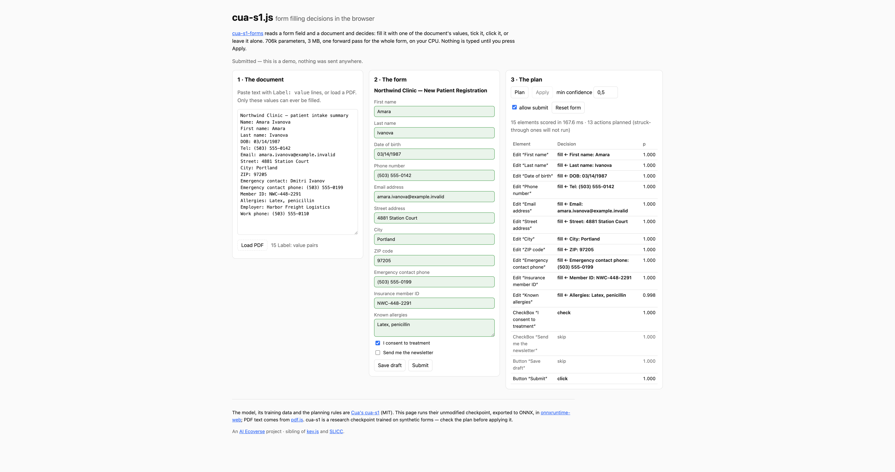

# @ai-ecoverse/cua-s1.js

[Cua's cua-s1-forms](https://huggingface.co/cua-ai/cua-s1-forms) form-filling decision model in the browser, via
onnxruntime-web. For every field of a form it reads the field and a document's `Label: value` pairs and decides:
fill the field with one of those values, tick it, click it, or leave it alone. It has 706k parameters, the ONNX
graph is 3.1 MB, and one forward pass scores the whole form on the CPU.

The model, its training data and the planning rules are Cua's
([trycua/cua `libs/cua-s1`](https://github.com/trycua/cua/tree/main/libs/cua-s1), MIT). This package runs their
unmodified checkpoint and ports the code around it.

**[Live demo](https://ai-ecoverse.github.io/cua-s1.js/)** · **[Weights](https://huggingface.co/ai-ecoverse/cua-s1.js)** · `npm install @ai-ecoverse/cua-s1.js onnxruntime-web`



```ts
import * as ort from "onnxruntime-web/wasm";
import { loadCuaS1, extractEntities } from "@ai-ecoverse/cua-s1.js";

const model = await loadCuaS1("https://huggingface.co/ai-ecoverse/cua-s1.js/resolve/main/cua-s1-forms", { ort });
const plan = await model.plan(
  "Northwind Clinic - New Patient Registration",
  [
    { role: "Edit", label: "Phone number", value: "", token: "phone" },
    { role: "CheckBox", label: "I consent to treatment", checked: false, token: "consent" },
    { role: "Button", label: "Submit", token: "submit" },
  ],
  extractEntities("Tel: (503) 555-0142\nWork phone: (503) 555-0110"),
  { minConfidence: 0.5, allowSubmit: false },
);
plan.decisions;   // one per element: action, entityIndex, probability, distribution
plan.actions;     // what to execute, in order: fills, checkboxes, then at most one submit click
```

Nothing is executed by the library: `plan()` returns decisions, and the caller applies them. The loader checks the
graph's SHA-256 against the manifest. Run the model in a Web Worker if the page can plan while hidden: Chrome
throttles a background tab's main thread, and the same 150 ms plan took 5–17 s there.

## How It Works

- **Export** (`export/export.py`): pins the Hugging Face repo to a commit, downloads the safetensors and JSON sidecar
  at that commit, and loads them with `cua_s1.model.load_checkpoint`, which validates the SHA-256 tensor signature.
  It then exports the model with the `torch.export`-based ONNX exporter, with dynamic batch, context, option and
  option-token axes. The legacy tracer bakes the sample's sequence length into `nn.MultiheadAttention`'s reshapes,
  so it can't be used here. The graph takes the tensors `ByteCollator` produces and returns logits and
  probabilities. A second graph runs the same modules for a batch whose rows share one option list, which every
  form plan is: it encodes the options once and broadcasts them to every element, where upstream's `forward`
  encodes them again for each row. `loadCuaS1` uses it when the manifest names one (`sharedOptions: false` opts
  out).
- **Verification:** the export scores 1,048 decisions from 40 synthetic episodes (`cua_s1.synth.episode_rows`, the
  training generator) in mixed batches with both PyTorch and onnxruntime. The largest probability difference is
  3.2e-6, with no argmax flips. The shared-options graph, one episode per batch, is held to upstream's unmodified
  PyTorch `forward` with the same result, and in onnxruntime it matches the per-row graph exactly. The PyTorch
  outputs are the fixtures for the JS tests, which run both graphs.
- **Runtime** (`src/`): a port of `render_context`, `render_options`, `ByteCollator`, the `Label: value` line parser
  from `pdf.py`, and the model-independent planner rules (actionable roles, title normalization, ordering, and the
  one-submit-click rule). The model only ever sees strings, so these are reproduced exactly: Python's code-point
  slicing, UTF-8 truncation by bytes, `errors="replace"` for lone surrogates, and `splitlines()`'s separators.
  `test/schema.test.ts` checks all of it against Python's output (`export/schema_fixtures.py`).
- **Demo** (`demo/`): reads a real HTML form from the DOM and maps text inputs and textareas to `Edit`, checkboxes
  to `CheckBox` and buttons to `Button`, the three roles cua-s1 was trained on. Selects and radio groups are left
  alone. It shows the plan, and fills the DOM only when you press Apply. PDF text comes from pdf.js.

## Results

On the demo's clinic form (15 elements, a document with 15 `Label: value` pairs including look-alikes such as
`Tel` / `Work phone` / `Emergency contact phone`), all 11 fields were filled with the right values. Consent was
ticked and the newsletter box left alone. The submit click only runs with `allowSubmit`.

- **Latency:** about 60 ms per plan on one WASM thread in a visible Chrome tab on an M4 Max, with the options
  encoded once per plan. The per-row graph, which re-encodes the 18 options for all 15 elements (270 option passes
  instead of 18), takes 160 ms. That is a 2.7× speedup, and the decisions are identical. It grows with the number of
  fields. The model loads in about 200 ms.

On the synthetic episodes, the PyTorch model itself picks the labelled option 98.7% of the time (1,034 of 1,048).
The model card reports 99.95% on its own form-disjoint test split. The misses are mostly conservative:
13 of 440 fills came out as `skip`, and one filled the wrong entity (a portfolio URL field took the LinkedIn URL,
p = 0.78). Keep a confidence threshold and look at the plan before applying it.

A threshold does not catch forms outside the training vocabulary. The synthetic forms draw every field label from
the 55 concepts in upstream's `cua_s1/concepts.py`, and on labels outside that catalogue (logistics, DevOps and
veterinary forms, and one Chinese form) the checkpoint scored 12 of 41 and answered `skip` for 36 of the 41 elements
at a mean confidence of 0.974 ([trycua/cua#3978](https://github.com/trycua/cua/issues/3978)). The form's own field
labels matter most: with the same structure and values but catalogue phrases as labels, 11 of 11 were right. A plan that
skips nearly every field on an unfamiliar form is the model being out of scope, not a form with nothing to fill.

## Development

```bash
git clone --recursive https://github.com/ai-ecoverse/cua-s1.js && cd cua-s1.js
cd export && uv sync && uv run python export.py --out ../public/models/cua-s1-forms
uv run python schema_fixtures.py > ../fixtures/schema.json
cd .. && npm install && npm test && npm run dev     # http://127.0.0.1:5174
```

`vendor/cua` is a sparse submodule of trycua/cua (`libs/cua-s1` only), so the export and the fixtures always run
Cua's own code. `export.py` pins the Hugging Face checkpoint to a commit and writes the bundle under `r-<commit>/`
with a `manifest.json`. `HF_TOKEN=... uv run python upload_hf.py` publishes it to `ai-ecoverse/cua-s1.js`, committing
the revision's files first and the manifest last, so switching to a new checkpoint is a single commit.

Releases publish to npm from CI (`.github/workflows/release.yaml`, trusted publishing, OIDC) via
[semantic-release](https://semantic-release.org/) on every push to `main`. Commits that follow
[Conventional Commits](https://www.conventionalcommits.org/) (`feat:`, `fix:`, `BREAKING CHANGE:`) cut the next
patch / minor / major; `v0.1.1` is the last hand-tagged release. The demo deploys to GitHub Pages on every push to
`main` and loads the weights from Hugging Face.

## License

MIT, like cua-s1. The ported schema and planner logic keep Cua AI, Inc.'s copyright notice (`LICENSE`), and the
checkpoint is MIT per its [model card](https://huggingface.co/cua-ai/cua-s1-forms). cua-s1 is a research
checkpoint trained on synthetic forms: read its model card and
[SECURITY.md](https://github.com/trycua/cua/blob/main/libs/cua-s1/SECURITY.md) before using it on anything that
matters.
